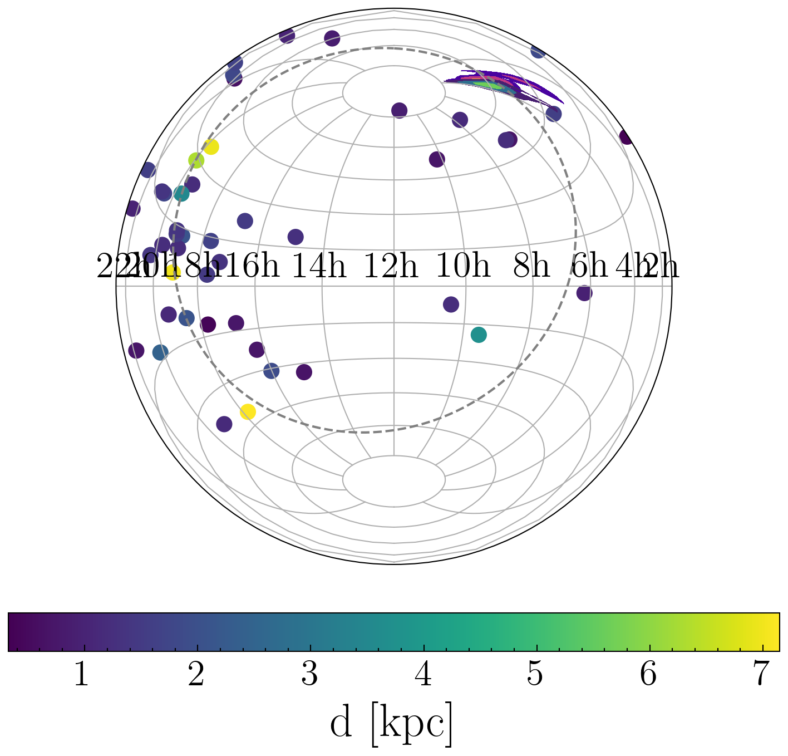

# StateSpacePTA

Welcome to the StateSpacePTA repo.

This is a research project for the detection of nHz gravitational waves. 

Please see the [documentation](https://tomkimpson.github.io/StateSpacePTA/)

